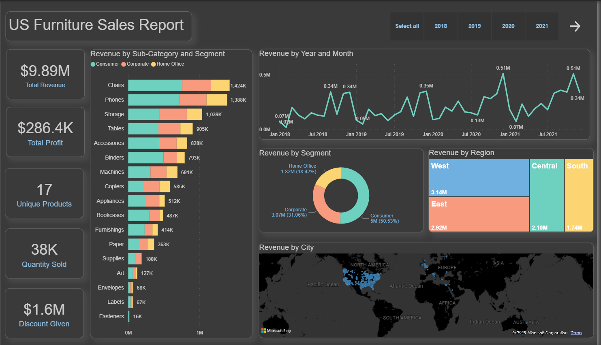
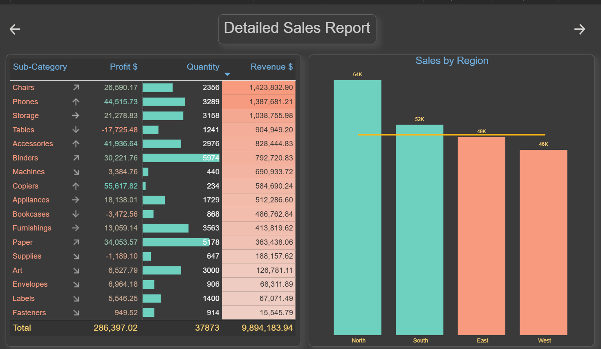
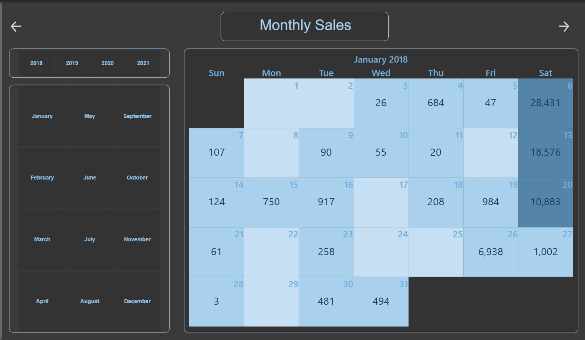
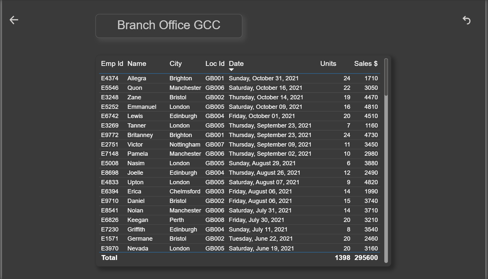

# US Furniture Sales — Executive Power BI Dashboard

A Power BI dashboard built as part of a structured training exercise: create an executive dashboard for a US furniture sales organization, covering global sales and profit performance, with a detailed drill-down page, a monthly heatmap, and a second independent data source.

> **Context:** This was built early in my Power BI learning journey, following a defined training brief (not a self-directed project). It's a good example of following a specific spec precisely — multiple pages, conditional formatting rules, custom visuals, and multiple data connections — while my later work (see my [Olist E-Commerce SQL + Power BI project](https://github.com/bristiovi/Olist_Eccomerce_Analytics)) reflects more independent, end-to-end analysis.

---

## Dashboard Pages

### 1. Sales Report (Executive Overview)
KPI cards for Total Revenue, Profit, Discount Given, Quantity Sold, and a measure counting active sub-categories, alongside revenue breakdowns by sub-category & segment (bar chart), segment (donut), region (treemap), city (map), and time (line chart). Includes a slicer and page-navigation button.

### 2. Detailed Sales Report
A sub-category-level table (Profit, Quantity, Revenue) with conditional formatting applied throughout:
- **Data bars** on Quantity
- **Font color** rules on Profit
- **Icon set** on Profit (based on a value-range comparison)
- **Background color** on Revenue

Alongside the table, a combo chart plots **Actual vs. Target sales by region**, using a separate `Regional Sales_Plan vs Actual Achievement.xlsx` source. The bars are colored based on whether each region hit its $50,000 target: North (63,610) and South (52,494) exceeded target and are shown in teal; East (49,389) and West (46,230) fell short and are shown in salmon — a conditional measure driving the color logic.

### 3. Monthly Sales
A calendar heatmap (custom "bciCalendar" visual) showing daily sales values across the year, with **two slicers** — one bound to the Year level and one to the Month level of the Order Date hierarchy — for quick period selection.

### 4. Branch Office GCC
This page intentionally uses a **separate, independent data source** (`Branch Office GCC.xlsx`, with its own Employees and Orders-style sheets) rather than the furniture sales data. It isn't meant to connect to the sales story — the exercise required practicing a second data connection and building a specific table (Employee ID, Name, City, Location ID, Date, Units Sold, Sales Value) from it, separate from the main analysis.

---

## Key Insights

- **Total Revenue:** $9.89M | **Total Profit:** $286.4K | **Units Sold:** 38K | **Discount Given:** $1.6M
- **Consumer segment dominates**, contributing 50.5% of revenue ($5M), followed by Corporate (31.1%) and Home Office (18.4%)
- **West region leads** in raw revenue ($3.14M), followed by East, Central, and South
- **Chairs, Phones, and Storage** are the top revenue-generating sub-categories
- **Profit doesn't always track revenue** — Tables generated $905K in revenue but posted a *negative* profit (-$17.7K), and Bookcases and Supplies also ran at a loss despite positive revenue — a pattern worth investigating further (e.g., discount rate by sub-category vs. margin)
- **Regional performance against target is mixed** — North and South beat their $50K sales target, while East and West fell short, visible directly in the Actual vs. Target chart

---

## Tools Used

- Power BI Desktop (Import mode)
- Custom visual: bciCalendar (calendar heatmap)
- DAX measures for KPIs, product counts, and target-achievement logic
- Multiple independent data connections (furniture sales, regional targets, branch office data)

---

## Files

- [`US_Furniture_Sales_Dashboard.pbix`](US_Furniture_Sales_Dashboard.pbix) — full Power BI file
- [`Data/US_Furniture_Sales Report.xlsx`] — main sales dataset
- `Data/Regional Sales_Plan vs Actual Achievement.xlsx` — regional target data
- `Data/Branch Office GCC.xlsx` — independent branch office dataset
- `ScreenShots/` — exported dashboard pages (above)

---

## Reflections

Built early in my Power BI learning journey to practice core dashboard-building skills: KPI cards, conditional formatting (data bars, font color, icon sets, background color), custom visuals, DAX measures for target-achievement logic, and managing multiple independent data sources in one file. Revisiting it now, the clearest area for growth is going beyond the required breakdowns to explore *why* patterns like the negative-profit sub-categories occur — the kind of follow-through I've since built into my more recent analytics work.
